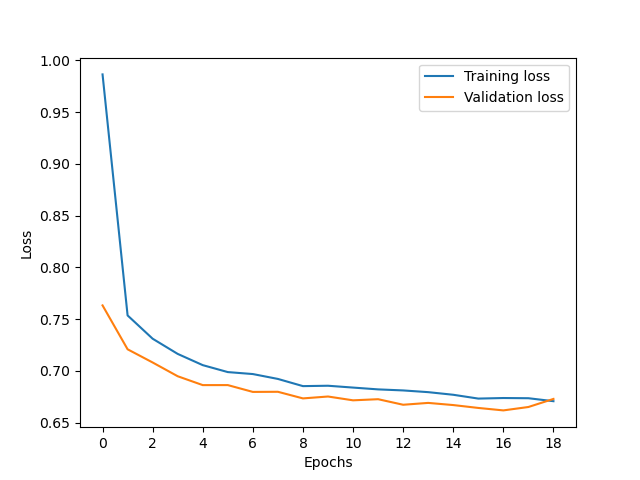

# Fahrschule
Learning driving from expert data

## Problem setting
For this project, we are going to train an agent to play car racing on OpenAI gym's CarRacing simulator using Imitation Learning (IL). IL is a research area closely related to the Reinforcement Learning. In Reinforcement Learning an agent interacts with an environment by following a policy. The agent takes action based on the policy and the current state, and as a result, receives a reward and transitions to a new state. The goal is to learn an optimal policy which maximizes the long-term cumulative rewards. However, in some settings learning such policies might be challenging due to the complexity of the environment or we might not even have access to agent's policy to optimize it and we may still need to infer a useful policy from the observed data. In such settings, IL can provide us with a solution by allowing us to learn from observational data provided by an expert an expert (typically a human). In this project we are going to generate expert data by manually playing the car racing game and use this dataset to train an agent.

## Methods
A very basic approach to IL is a method called Behavioural Cloning which formulates the setting as a supervised learning problem: expert’s demonstrations are divided into state-action pairs and use these pairs as input/label fashion to train a model. The main drawback of this method is that it is prone to generalization errors especially if the agent finds itself in situations where it was not demonstrated before. Therefore, it is very important to use models with good generalization capabilities.

As the problem setting is not very complex (fairly simple state space without much variation, non-presence of other agents in the environment, low dimensional action space) we can apply this method for this project.

### Input space and state representation:
Input space of the model is 96x96 pixel bird's eye view image of the simulation environment as shown in the figure below:

 

While several convolutional layers can already provide a robust state representation, a better approach can be Variational Autoencoders (VAE). The general idea of autoencoders is setting an encoder and a decoder as neural networks and learning the optimal encoding-decoding scheme. The encoder compresses the input in scale to a latent space and the decoder expands this latent space back to the original dimension. When output is enforced to be the same as the input through the loss function, this bottleneck ensures only the main structured part of the information can go through and be reconstructed. However, the latent space of conventional autoencoders lack regularity: neighbouring points in the latent space do not necessarily correspond to neighbouring states in the input space. VAEs solve this problem by enforcing such regularity in the latent space. This is especially important in our case since this bestows us good generalization capabilities: if the model encounters a state which it has not seen during training but it has seen similar states, it can still infer the right action to take. 

VAEs are used intensively in related works dealing with similar problems. It also allows further extensions, for example an action-conditioned state transition model can be plugged seamlessly as in [1] and [2] or it can be trained in a generative adverserial setting as in [3] if generating realistic samples for simulation is also an objective.

An architecture similar to [1] is also used here. As pre-processing, the bottom panel from the images is cropped out and the remaining part of the image is downscaled to 64x64 to have consistent strides in the encoder/decoder. The VAE is trained separately for 10 epochs and to verify its function, several example images (top) and their reconstructions (bottom) are visualized below:

 

 

As we can see, the VAE suppresses information with high-variance (e.g. grass) and retains vital task relevant information (e.g. road, car).

### Action space:
The human control interface for generating expert data allows very few selection of actions (1 value for acceleration, brake, left turn and right turn). Here is an histogram of actions taken during 25 episodes of expert demonstrations:

 

For comparison, here is a RL agent trained following the methods in [1]:

 

If we were using an AI as expert, we could choose continous action space (actually this was tested and works quite well). But in this case, discrete action space seems like a better option. 5 actions are defined: Steer Left, Steer Right, Accelerate, Brake, No Action. This implies that combination of actions are not regarded and in such cases the action is mapped to one of these 5 cases depending on pre-defined heuristics. This desing choice was simply due to author's personal experience on playing the game, usually a player only uses one action at a time. The following figure shows the histogram of action preferences from 25 expert demonstrations after mapping:

 

### Policy network and the loss function:
For policy network a simple all-to-all connected neural network with one hidden layer is used. The above figure illustrating the expert action preferences indicates that our database is highly unbalanced and has a bias towards taking no action. In order not to have a biased model, it is necessary to deal with this problem. One remedy for this is to use CrossEntropy loss instead of MSE loss so that the model is penalized more heavily for cases where model is very sure on wrong decisions. In addition to this, a common practice is to sample the database in inverse proportion to each action's presence in the database i.e. actions that are low in number are sampled more. An alternative approach, which is also implemented here, is to use weighted loss function i.e. actions that are low in number are weighted more in loss. Weights are calculated in inverse proportion to action's population in the database.

Another implemented feature is epsilon greedy action selection strategy: at any given time action Accelerate is selected for several consecutive timesteps with the probability of epsilon<<0. Experiments are conducted for values of epsilon 0 and 0.01. This strategy can trigger the agent to go out of dead-lock situations and can have significant effects on the outcomes of the race.

## Implementation
### Generating expert data
To generate expert data `record_data.py` script can be used:

`python record_data.py --data_folder ./data_human --num_episode 5`

This will setup the game environment for manual play for 5 episodes of games and save each episode in a separate file under the subfolder data_human. Samples are recorded as list of tuples, where each tuple is composed of (current state, received reward, taken action). A dataset class compatible with pytorch's data loader is also implemented and can be used with other recorded data if it follows the aforementioned format.

### Training models
Training is composed of two stages: training the VAE and training the policy network. This can be achieved via `train.py` script:

`python train.py --data_folder ./data_human --num_epochs 20 --num_epochs_vae 10`

This command will first train a VAE for 10 epochs and then the policy network for 20 epochs using the data provided in subdirectory data_human. A policy network can also be trained separately if there exists a pre-trained VAE:

`python train.py --data_folder ./data_human --num_epochs 20 --do_load_vae 1 --vae_model_file ./checkpoint/checkpoint.vae.epoch.9.tar`

or training can continue from a previous checkpoint:

`python train.py --data_folder ./data_human --num_epochs 40 --do_load_vae 1 --vae_model_file ./checkpoint/checkpoint.vae.epoch.9.tar --model_file ./checkpoint/checkpoint.policy.epoch.19.tar --load_epoch 19`

This command will load the given policy network from epoch 19 and continue training until epoch 40. More information on allowed arguments can be accessed via command `python train.py -h`. More detailed modifications on hyperparameters can be done from within the script.

### Evaluating models
A simple evaluation script `evaluate.py` is implemented to test the model in simulation environment:

`python evaluate.py  --vae_model_file ./checkpoint/checkpoint.vae.epoch.9.tar --model_file ./checkpoint/checkpoint.policy.epoch.19.tar --num_episode 5 --epsilon 0.01`

This command will run the given model for 5 episodes of game with epsilon set to 0.01. 

### Expert corrections on learned policies
After the model is trained, it can be executed in the simulation environment in interactive mode where the human expert can override the actions of the model. Whenever the expert overrides an action, this is considered as a correction and respecive samples (state, reward, override action) are saved for re-training after the simulations. This is a very useful feature and has great value in real-world applications such as autonomous driving where driver interventions can be collected to improve models. This is realized using `retrain_with_expert.py` script:

`python retrain_with_expert.py  --vae_model_file ./checkpoint/checkpoint.vae.epoch.9.tar --model_file ./checkpoint/checkpoint.policy.epoch.19.tar --num_episode 5`

The script automatically re-trains the network after the game episodes are done but data is also saved for training later.

## Results
The evolution of policy network training in terms of loss is shown in the figure below:

 

Training loss decreases rapidly in the first few epochs and still has tendency to decrease at epoch 20. Further experiments with longer training periods indeed showed lower loss values but no significant improvement in the agent's performance. Validation loss also decreases rapidly and stays below the training loss. Everything looks normal.

## Disclaimers

## Sources
- [Code](https://github.com/cemkaraoguz/Fahrschule)
- [Models](https://github.com/cemkaraoguz/Fahrschule/tree/main/models)
  - vae.epoch.9.tar : VAE model
  - policy.epoch.19.tar : Policy network trained on expert data
  - policy.ft.epoch.20.tar : Policy network trained on expert data and fine tuned with expert corrections
- [Datasets](https://drive.google.com/drive/folders/1IAjsZQ8uWzMVeMHCNOHFhTFlUep04BzW?usp=sharing)
  - data_human : expert data from human
  - data_human_ft : expert corrections from interactive mode

## References
[1] Ha, David, and Jürgen Schmidhuber. "World models." arXiv preprint arXiv:1803.10122 (2018). [Link](https://arxiv.org/pdf/1803.10122.pdf)

[2] Henaff, Mikael, Alfredo Canziani, and Yann LeCun. "Model-predictive policy learning with uncertainty regularization for driving in dense traffic." arXiv preprint arXiv:1901.02705 (2019). [Link](https://arxiv.org/pdf/1901.02705.pdf)

[3] Santana, Eder, and George Hotz. "Learning a driving simulator." arXiv preprint arXiv:1608.01230 (2016). [Link](https://arxiv.org/pdf/1608.01230.pdf)
